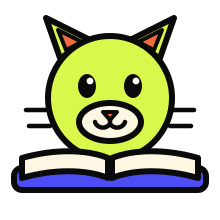

# Nibble

Bite-sized answers from your own notes. Upload a chapter, ask a question, get an
answer that comes from *your* material — with the page it came from.

- **Frontend:** React (plain JavaScript, built with Vite)
- **Backend:** FastAPI (Python)
- **Database:** SQLite — one file, nothing to install
- **Embeddings:** `bge-small-en-v1.5`, running locally on your own laptop
- **Answers:** open-source Llama models via [Groq](https://console.groq.com), free

Everything here is free. There is no paid API and no credit card anywhere in
this project.

> **New to the project? Start with [`docs/first-week.md`](docs/first-week.md).**
> It assumes you have never used a terminal, and it is the fastest way to get
> from nothing to a running app.
>
> Then read [`docs/how-it-works.md`](docs/how-it-works.md) to understand what
> you just ran.

---

## Get it running

You need [Python 3.12+](https://www.python.org/downloads/) and
[Node 22+](https://nodejs.org/). That's all — no Docker, no database server.

**1. The backend** (first terminal):

```bash
cd backend
python -m venv .venv
.venv\Scripts\activate        # Mac/Linux: source .venv/bin/activate
pip install -e ".[dev]"
cp .env.example .env          # Windows: copy .env.example .env
uvicorn app.main:app --reload
```

Check it worked: <http://localhost:8000/health> shows `{"status":"ok"}`.

**2. The frontend** (second terminal, leave the first running):

```bash
cd frontend
npm install
npm run dev
```

Open <http://localhost:5173>. Nibble should say the backend is up.

---

## How we're building it

In **vertical slices**. Every slice is a working app you could demo, not a layer
of a half-built one.

| Slice | What it adds | State |
|---|---|---|
| 0 | The frontend and backend talk to each other | ✅ done |
| 1 | Upload a PDF and list it | planned |
| 2 | Cut documents into chunks | planned |
| 3 | Search your notes — *no AI yet* | planned |
| 4 | Nibble answers, with sources | planned |
| 5 | Make it look like Nibble | planned |
| 6 | Quiz mode | stretch |

Slice 3 is the interesting one: semantic search working with no chatbot
involved at all.

---

## Where things are

```
backend/app/routes.py   every URL the frontend can call
backend/app/config.py   every setting, in one place
frontend/src/App.jsx    the page
frontend/src/api.js     the only file that knows the backend's address
docs/api.md             the contract between the two — read before building
```

## Docs

| File | What it's for |
|---|---|
| [`docs/first-week.md`](docs/first-week.md) | Setup, from zero. Start here. |
| [`docs/how-it-works.md`](docs/how-it-works.md) | How the whole thing works, in plain English |
| [`docs/api.md`](docs/api.md) | The frontend ↔ backend contract |
| [`docs/team.md`](docs/team.md) | Who owns what, and how we use git |
| [`docs/design.md`](docs/design.md) | Colours, shapes, and Nibble's voice |
| [`docs/adr/`](docs/adr/) | Why we chose what we chose |

## Using AI on this project

Allowed and expected. The one rule: **don't merge code you can't explain.** Every
pull request asks you to describe your change in your own words, and the reviewer
will ask you one question about it. That's the whole quality bar.
